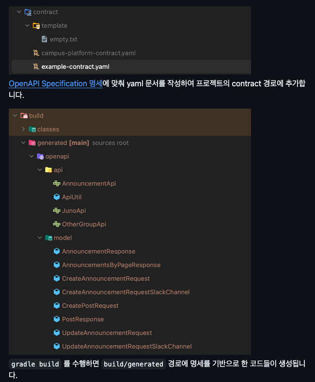

# OpenAPI CodeGenerator 테스트
- "인프콘 2024 - OpenAPI Generator 실전편 : 효율적인 코드를 작성하는 법 - 이한" OpenAPI Generator 확인
- 코드 구현 참고 : https://velog.io/@junho5336/OpenAPI-CodeGenerator-%ED%99%9C%EC%9A%A9%ED%95%98%EA%B8%B0

# 사용 방법
폴더 경로에서 gradle 빌드 진행

```angular2html
$ ./gradlew build
```




이후 생성된 인터페이스를 구현하여 코드 구현을 진행한다.